# PRM System — UML Diagrams

> All diagrams derived from [PROJECT_CONTEXT.md](file:///c:/Users/jayesh.s.lodha/OneDrive%20-%20InTimeTec%20Visionsoft%20Pvt.%20Ltd.,/Documents/project-resource-manager/PROJECT_CONTEXT.md) and [PRM_BRD_V4.md](file:///c:/Users/jayesh.s.lodha/OneDrive%20-%20InTimeTec%20Visionsoft%20Pvt.%20Ltd.,/Documents/project-resource-manager/PRM_BRD_V4.md).

---

## 1. Class Diagram

Shows the domain entities (PRM.Core), service/repository interfaces, and their relationships across Clean Architecture layers.

```mermaid
classDiagram
    direction TB

    %% ─────────────── ENUMS ───────────────
    class EmployeeStatus {
        <<enumeration>>
        Allocated
        Bench
    }

    class ProjectStatus {
        <<enumeration>>
        Planned
        Active
        OnHold
        Completed
    }

    class MilestoneStatus {
        <<enumeration>>
        NotStarted
        InProgress
        Done
    }

    class HealthStatus {
        <<enumeration>>
        OnTrack
        Attention
        AtRisk
    }

    class TimesheetStatus {
        <<enumeration>>
        Submitted
        Missed
    }

    class SkillCategory {
        <<enumeration>>
        Backend
        Frontend
        DevOps
        QA
        Other
    }

    class ProficiencyLevel {
        <<enumeration>>
        Beginner
        Intermediate
        Advanced
    }

    %% ─────────────── DOMAIN ENTITIES ───────────────
    class Permission {
        +int Id
        +string Name
        +string Description
    }

    class RolePermission {
        +int RoleId
        +int PermissionId
        +Role Role
        +Permission Permission
    }

    class Role {
        +int Id
        +string Name
        +string Description
        +List~User~ Users
        +List~RolePermission~ RolePermissions
    }

    class User {
        +int Id
        +string Username
        +string Email
        +string PasswordHash
        +int RoleId
        +Role Role
        +string FullName
        +string Department
        +int ManagerId
        +bool IsActive
        +bool ForcePasswordChange
        +DateTime CreatedAt
        +DateTime UpdatedAt
        +User Manager
        +List~User~ DirectReports
        +List~UserSkill~ UserSkills
        +List~Allocation~ Allocations
        +List~Timesheet~ Timesheets
    }

    class Skill {
        +int Id
        +string Name
        +SkillCategory Category
    }

    class UserSkill {
        +int UserId
        +int SkillId
        +ProficiencyLevel ProficiencyLevel
        +User User
        +Skill Skill
    }

    class Project {
        +int Id
        +string Name
        +string Description
        +DateTime StartDate
        +DateTime EndDate
        +ProjectStatus Status
        +int ManagerId
        +int TotalStoryPoints
        +HealthStatus HealthStatus
        +DateTime CreatedAt
        +DateTime UpdatedAt
        +User Manager
        +List~Milestone~ Milestones
        +List~Allocation~ Allocations
    }

    class Milestone {
        +int Id
        +int ProjectId
        +string Title
        +DateTime DueDate
        +int StoryPoints
        +MilestoneStatus Status
        +Project Project
    }

    class Allocation {
        +int Id
        +int UserId
        +int ProjectId
        +int UtilisationPercent
        +DateTime FromDate
        +DateTime ToDate
        +User User
        +Project Project
    }

    class Timesheet {
        +int Id
        +int UserId
        +DateTime WeekStartDate
        +TimesheetStatus Status
        +DateTime SubmittedAt
        +User User
        +List~TimesheetEntry~ Entries
    }

    class TimesheetEntry {
        +int Id
        +int TimesheetId
        +int ProjectId
        +decimal HoursWorked
        +string ActivityTags
        +Timesheet Timesheet
        +Project Project
    }

    class SystemConfig {
        +string Key
        +string Value
    }

    %% ─────────────── RELATIONSHIPS ───────────────
    Role "1" -- "0..*" RolePermission : has
    Permission "1" -- "0..*" RolePermission : granted via
    Role "1" -- "0..*" User : assigned to
    User "0..1" -- "0..*" User : manages
    User "1" -- "0..*" UserSkill : possesses
    Skill "1" -- "0..*" UserSkill : assigned to
    User "1" -- "0..*" Allocation : allocated via
    Project "1" -- "0..*" Allocation : resources
    Project "1" -- "0..*" Milestone : broken into
    User "1" -- "0..*" Timesheet : submits
    Timesheet "1" -- "1..*" TimesheetEntry : contains
    TimesheetEntry "0..*" -- "1" Project : logs hours on
    Project "0..*" -- "1" User : managed by

    %% ─────────────── SERVICE INTERFACES ───────────────
    class IUserRepository {
        <<interface>>
        +GetByIdAsync(id) User
        +GetAllAsync(filter) List~User~
        +AddAsync(user) void
        +UpdateAsync(user) void
        +DeactivateAsync(id) void
    }

    class IProjectRepository {
        <<interface>>
        +GetByIdAsync(id) Project
        +GetAllAsync() List~Project~
        +GetByManagerIdAsync(managerId) List~Project~
        +AddAsync(project) void
        +UpdateAsync(project) void
    }

    class IAllocationRepository {
        <<interface>>
        +GetByEmployeeIdAsync(employeeId) List~Allocation~
        +GetByProjectIdAsync(projectId) List~Allocation~
        +GetOverlapping(employeeId, from, to) List~Allocation~
        +AddAsync(allocation) void
        +EndAllocationAsync(id, endDate) void
    }

    class ITimesheetRepository {
        <<interface>>
        +GetByEmployeeAndWeekAsync(employeeId, weekStart) Timesheet
        +GetByEmployeeIdAsync(employeeId) List~Timesheet~
        +AddAsync(timesheet) void
    }

    class ILlmProvider {
        <<interface>>
        +GetSkillMatchAsync(requirement, candidates) SkillMatchResult
        +GetRiskSummaryAsync(projectData) string
    }

    class IUserService {
        <<interface>>
        +GetAllUsersAsync(filter) List~UserDto~
        +UpdateUserAsync(dto) void
        +DeactivateUserAsync(id) void
        +ManageSkillsAsync(userId, skillDto) void
        +AssignManagerAsync(userId, managerId) void
    }

    class IProjectService {
        <<interface>>
        +CreateProjectAsync(dto) ProjectDto
        +UpdateProjectAsync(dto) void
        +GetProjectHealthAsync(projectId) ProjectHealthDto
        +ManageMilestonesAsync(projectId, milestoneDto) void
    }

    class IAllocationService {
        <<interface>>
        +AllocateResourceAsync(dto) AllocationDto
        +EndAllocationAsync(allocationId) void
        +ValidateAllocationAsync(dto) ValidationResult
    }

    class ITimesheetService {
        <<interface>>
        +SubmitTimesheetAsync(dto) TimesheetDto
        +GetTimesheetsAsync(employeeId) List~TimesheetDto~
        +GetTeamTimesheetsAsync(managerId, week) List~TimesheetDto~
    }

    class IAiService {
        <<interface>>
        +FindSkillMatchAsync(requirement, projectId) List~MatchResultDto~
        +GenerateRiskSummaryAsync(projectId) string
    }

    class IAuthService {
        <<interface>>
        +LoginAsync(username, password) AuthResult
        +ChangePasswordAsync(userId, newPassword) void
        +ResetPasswordAsync(userId, tempPassword) void
    }

    %% ─────────────── LAYER CONNECTIONS ───────────────
    IUserService ..> IUserRepository : uses
    IProjectService ..> IProjectRepository : uses
    IAllocationService ..> IAllocationRepository : uses
    ITimesheetService ..> ITimesheetRepository : uses
    IAiService ..> ILlmProvider : delegates to
    IAllocationService ..> IUserRepository : checks capacity
```

---

## 2. ER Diagram

Full database schema with tables, columns, types, primary keys, foreign keys, and cardinalities.

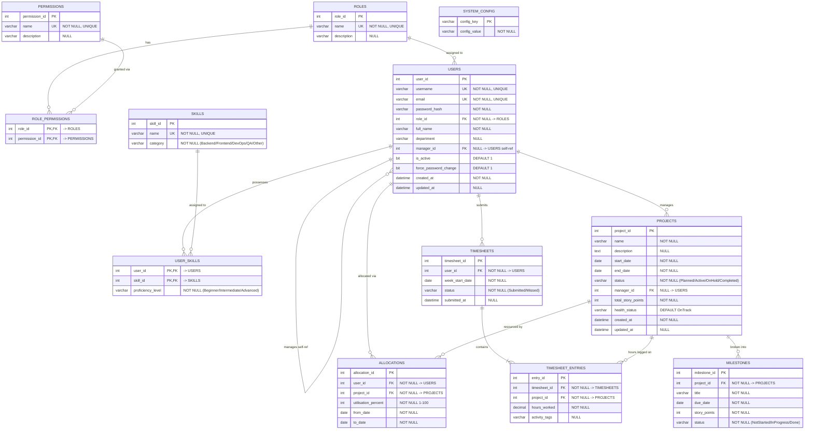

---

## 3. Use Case Diagram

All use cases grouped by actor — Admin, Manager, Employee, Background Scheduler, and LLM Provider.

```mermaid
flowchart TB
    subgraph System["PRM System"]
        direction TB

        subgraph Auth["Authentication"]
            UC_LOGIN["Login"]
            UC_CHANGE_PWD["Change Password - forced on first login"]
            UC_LOGOUT["Logout"]
        end

        subgraph AdminUC["Admin Use Cases"]
            UC_CREATE_USER["Create User Account"]
            UC_VIEW_USERS["View All Users"]
            UC_RESET_PWD["Reset User Password"]
            UC_DEACTIVATE_USER["Deactivate User"]
            UC_REACTIVATE_USER["Reactivate User"]
            UC_VIEW_EMPLOYEES["View All Employees"]
            UC_UPDATE_EMPLOYEE["Update Employee"]
            UC_DEACTIVATE_EMPLOYEE["Deactivate Employee"]
            UC_MANAGE_SKILLS["Manage Employee Skills"]
            UC_ASSIGN_MANAGER["Assign Manager"]
            UC_CREATE_PROJECT["Create Project"]
            UC_VIEW_PROJECTS["View All Projects"]
            UC_UPDATE_PROJECT["Update Project Details"]
            UC_MANAGE_MILESTONES["Manage Milestones"]
            UC_VIEW_ALLOCATIONS_ADMIN["View All Allocations"]
            UC_SYS_CONFIG["System Configuration"]
        end

        subgraph ManagerUC["Manager Use Cases"]
            UC_RESOURCE_DASHBOARD["Resource Dashboard"]
            UC_DRILL_EMPLOYEE["Drill into Employee Details"]
            UC_AI_SKILL_MATCH["AI Skill Match"]
            UC_DIRECT_ALLOCATE["Direct Allocation"]
            UC_END_ALLOCATION["End Allocation"]
            UC_MY_PROJECTS["My Projects"]
            UC_PROJECT_HEALTH["View Project Health"]
            UC_AI_RISK_SUMMARY["AI Risk Summary"]
            UC_VIEW_TEAM_TIMESHEETS["View Team Timesheets"]
        end

        subgraph EmployeeUC["Employee Use Cases"]
            UC_SUBMIT_TIMESHEET["Submit Timesheet"]
            UC_VIEW_MY_TIMESHEETS["View My Timesheets"]
            UC_VIEW_MY_ALLOCATIONS["View My Allocations"]
        end

        subgraph BackgroundUC["Background Scheduler"]
            UC_COMPUTE_UTILISATION["Compute Utilisation"]
            UC_FLAG_HEALTH["Flag Project Health"]
            UC_DETECT_MISSED_TS["Detect Missed Timesheets"]
        end
    end

    ADMIN(("Admin"))
    MANAGER(("Manager"))
    EMPLOYEE(("Employee"))
    SCHEDULER(("Scheduler"))
    LLM(("LLM Provider"))

    %% Auth connections
    ADMIN --> UC_LOGIN
    ADMIN --> UC_CHANGE_PWD
    ADMIN --> UC_LOGOUT
    MANAGER --> UC_LOGIN
    MANAGER --> UC_CHANGE_PWD
    MANAGER --> UC_LOGOUT
    EMPLOYEE --> UC_LOGIN
    EMPLOYEE --> UC_CHANGE_PWD
    EMPLOYEE --> UC_LOGOUT

    %% Admin use cases
    ADMIN --> UC_CREATE_USER
    ADMIN --> UC_VIEW_USERS
    ADMIN --> UC_RESET_PWD
    ADMIN --> UC_DEACTIVATE_USER
    ADMIN --> UC_REACTIVATE_USER
    ADMIN --> UC_VIEW_EMPLOYEES
    ADMIN --> UC_UPDATE_EMPLOYEE
    ADMIN --> UC_DEACTIVATE_EMPLOYEE
    ADMIN --> UC_MANAGE_SKILLS
    ADMIN --> UC_ASSIGN_MANAGER
    ADMIN --> UC_CREATE_PROJECT
    ADMIN --> UC_VIEW_PROJECTS
    ADMIN --> UC_UPDATE_PROJECT
    ADMIN --> UC_MANAGE_MILESTONES
    ADMIN --> UC_VIEW_ALLOCATIONS_ADMIN
    ADMIN --> UC_SYS_CONFIG

    %% Manager use cases
    MANAGER --> UC_RESOURCE_DASHBOARD
    UC_RESOURCE_DASHBOARD --> UC_DRILL_EMPLOYEE
    MANAGER --> UC_AI_SKILL_MATCH
    MANAGER --> UC_DIRECT_ALLOCATE
    MANAGER --> UC_END_ALLOCATION
    MANAGER --> UC_MY_PROJECTS
    UC_MY_PROJECTS --> UC_PROJECT_HEALTH
    MANAGER --> UC_AI_RISK_SUMMARY
    MANAGER --> UC_VIEW_TEAM_TIMESHEETS

    %% Employee use cases
    EMPLOYEE --> UC_SUBMIT_TIMESHEET
    EMPLOYEE --> UC_VIEW_MY_TIMESHEETS
    EMPLOYEE --> UC_VIEW_MY_ALLOCATIONS

    %% Background scheduler
    SCHEDULER --> UC_COMPUTE_UTILISATION
    SCHEDULER --> UC_FLAG_HEALTH
    SCHEDULER --> UC_DETECT_MISSED_TS

    %% LLM connections
    UC_AI_SKILL_MATCH --> LLM
    UC_AI_RISK_SUMMARY --> LLM
```

---

## 4. Sequence Diagrams

### 4.1 Login and Authentication Flow

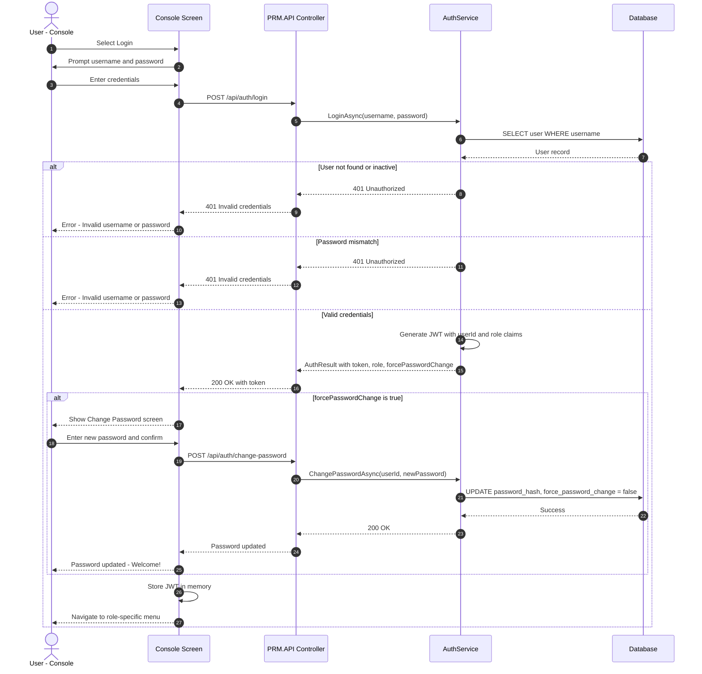

### 4.2 AI-Assisted Resource Allocation

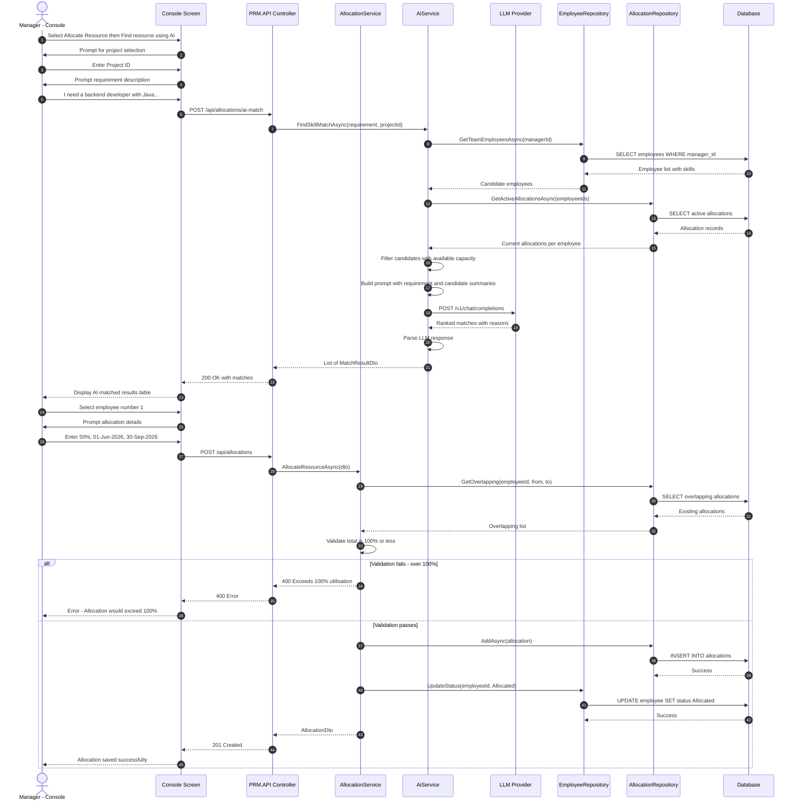

### 4.3 Timesheet Submission

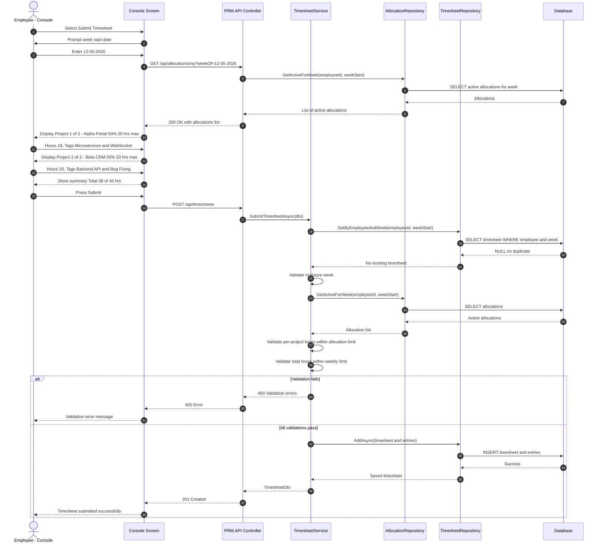

### 4.4 AI Risk Summary

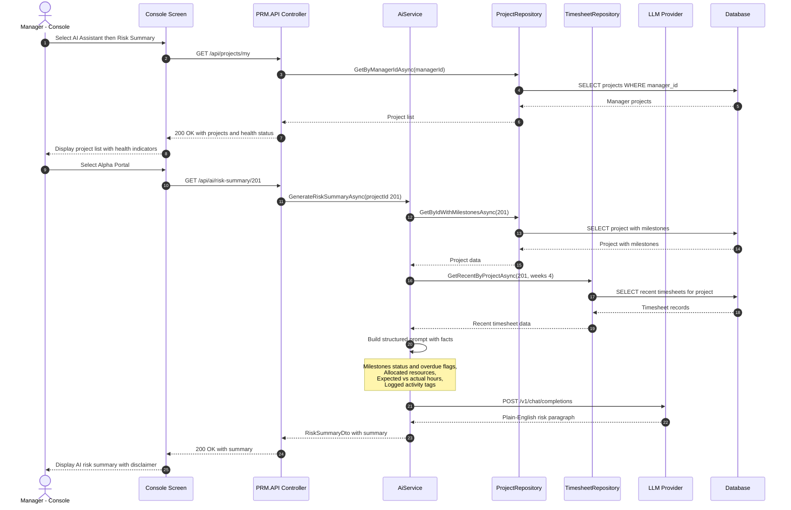

---

## 5. Activity / Sequence Flow Diagrams

### 5.1 Allocation Validation Flow

Decision-flow for validating a resource allocation request.

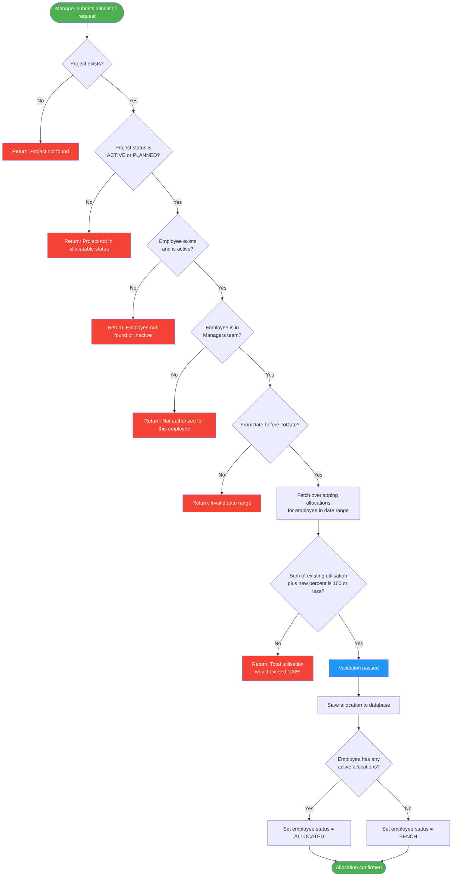

### 5.2 Timesheet Submission Flow

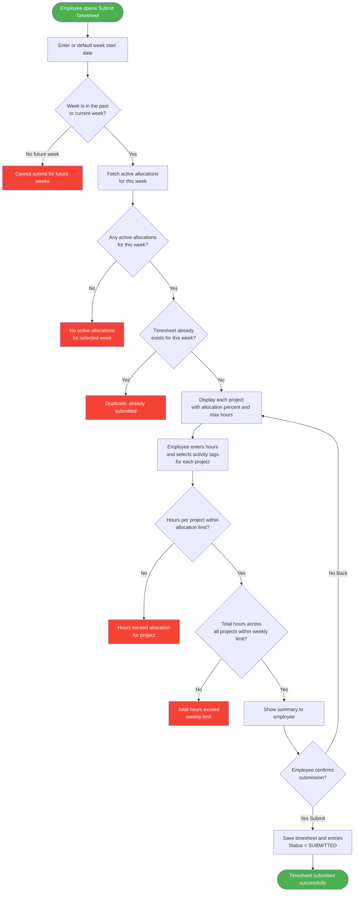

### 5.3 Background Scheduler Job Flow

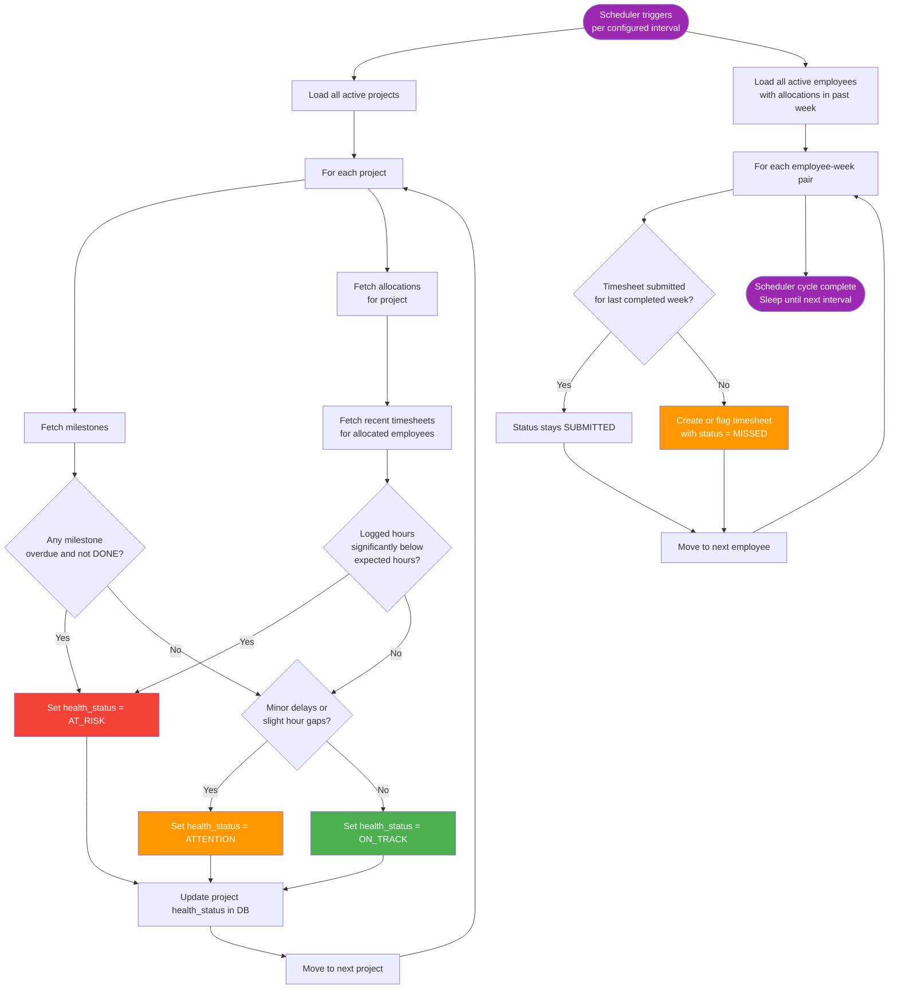

### 5.4 Employee Deactivation Flow

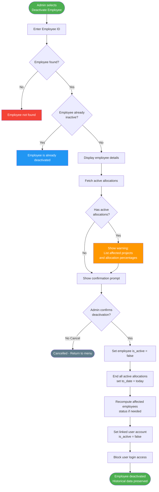

---

> [!NOTE]
> These diagrams use Mermaid syntax and render natively in most Markdown viewers (GitHub, VS Code with Mermaid extension, etc.). Install a Mermaid preview extension if they appear as raw code.
