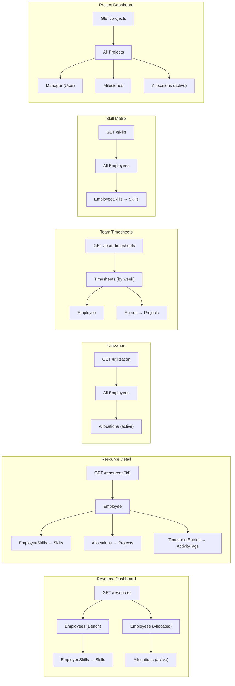

# Phase 1 — Dashboard & Report APIs: Workflow Documentation

## Table of Contents

1. [API Reference](#1-api-reference)
2. [Data Flow & Entity Relationships](#2-data-flow--entity-relationships)
3. [Business Rules](#3-business-rules)
4. [Context for Later Phases](#4-context-for-later-phases)

---

## 1. API Reference

All endpoints are served under `GET /api/dashboard/*`. No authentication is enforced at the API level yet (this will be added when the Console Client is built with JWT support).

---

### 1.1 Dashboard Summary (existing)

```
GET /api/dashboard/summary
```

**Response** `200 OK`:

```json
{
  "totalEmployees": 5,
  "allocatedEmployees": 2,
  "benchEmployees": 3,
  "activeProjects": 3,
  "submittedTimesheets": 8,
  "missedTimesheets": 1
}
```

---

### 1.2 Resource Dashboard

```
GET /api/dashboard/resources
```

**Purpose:** Powers BRD Screen 4.1 (Manager → Resource Dashboard). Shows all bench employees with their skills, and all allocated employees with utilisation and availability.

**Response** `200 OK`:

```json
{
  "benchEmployees": [
    {
      "id": 102,
      "fullName": "Priya Sharma",
      "department": "Frontend",
      "skills": ["React", "TypeScript", "CSS"]
    }
  ],
  "activeEmployees": [
    {
      "id": 101,
      "fullName": "Ravi Kumar",
      "totalAllocationPercent": 100,
      "availability": "FULL"
    },
    {
      "id": 104,
      "fullName": "Neha Joshi",
      "totalAllocationPercent": 75,
      "availability": "25% free"
    }
  ],
  "benchCount": 1,
  "partiallyAllocatedCount": 1
}
```

---

### 1.3 Resource Detail (Drill-down)

```
GET /api/dashboard/resources/{employeeId}
```

**Purpose:** Drill-down from Resource Dashboard. Powers the `[D] Drill into employee details` option in BRD Screen 4.1.

**Response** `200 OK`:

```json
{
  "id": 101,
  "fullName": "Ravi Kumar",
  "department": "Backend",
  "status": "Allocated (100%)",
  "totalAllocationPercent": 100,
  "profileSkills": ["Java", "Spring Boot", "MySQL"],
  "activeAllocations": [
    {
      "projectName": "Alpha Portal",
      "utilizationPercent": 50,
      "fromDate": "2026-03-01",
      "toDate": "2026-06-30"
    },
    {
      "projectName": "Beta CRM",
      "utilizationPercent": 50,
      "fromDate": "2026-04-01",
      "toDate": "2026-07-31"
    }
  ],
  "recentActivityTags": ["Microservices Architecture", "WebSocket", "Backend API", "Bug Fixing"]
}
```

**Response** `404 Not Found` — if employee ID does not exist or is inactive.

---

### 1.4 Utilization Report

```
GET /api/dashboard/utilization
```

**Purpose:** Company-wide utilization view. Lists every active employee with their total allocation % and derived status.

**Response** `200 OK`:

```json
{
  "employees": [
    {
      "employeeId": 101,
      "fullName": "Ravi Kumar",
      "department": "Backend",
      "utilizationPercent": 100,
      "allocationStatus": "Full"
    },
    {
      "employeeId": 102,
      "fullName": "Priya Sharma",
      "department": "Frontend",
      "utilizationPercent": 0,
      "allocationStatus": "Bench"
    },
    {
      "employeeId": 104,
      "fullName": "Neha Joshi",
      "department": "Backend",
      "utilizationPercent": 75,
      "allocationStatus": "Partial"
    }
  ]
}
```

---

### 1.5 Team Timesheets Report

```
GET /api/dashboard/team-timesheets?weekStartDate=2026-05-12
```

**Purpose:** Powers BRD Screen 4.4 (Manager → Timesheets — My Team). One row per employee × project with hours and status.

**Query Parameters:**

| Parameter | Type | Required | Default |
|-----------|------|----------|---------|
| `weekStartDate` | `DateTime` | No | Last Monday from today |

**Response** `200 OK`:

```json
{
  "weekStartDate": "2026-05-12",
  "entries": [
    {
      "employeeId": 101,
      "employeeName": "Ravi Kumar",
      "projectName": "Alpha Portal",
      "hoursWorked": 18,
      "status": "SUBMITTED"
    },
    {
      "employeeId": 101,
      "employeeName": "Ravi Kumar",
      "projectName": "Beta CRM",
      "hoursWorked": 20,
      "status": "SUBMITTED"
    },
    {
      "employeeId": 103,
      "employeeName": "Anil Mehta",
      "projectName": "Gamma Rewrite",
      "hoursWorked": 0,
      "status": "MISSED"
    }
  ]
}
```

---

### 1.6 Skill Matrix Report

```
GET /api/dashboard/skills
```

**Purpose:** Skill-based resource view. Shows all employees with their skills, categories, and proficiency levels.

**Response** `200 OK`:

```json
{
  "employees": [
    {
      "employeeId": 101,
      "fullName": "Ravi Kumar",
      "department": "Backend",
      "skills": [
        {
          "skillName": "Java",
          "category": "Backend",
          "proficiencyLevel": "Intermediate"
        },
        {
          "skillName": "Spring Boot",
          "category": "Backend",
          "proficiencyLevel": "Advanced"
        }
      ]
    }
  ]
}
```

---

### 1.7 Project Dashboard

```
GET /api/dashboard/projects
```

**Purpose:** Powers BRD Screen 3.2.2 (Admin → View All Projects) and Screen 4.3 (Manager → My Projects). Full project view with milestones, progress, and resource counts.

**Response** `200 OK`:

```json
{
  "projects": [
    {
      "projectId": 201,
      "projectName": "Alpha Portal",
      "managerName": "Ankit Shah",
      "endDate": "2026-06-30",
      "status": "Active",
      "healthStatus": "AtRisk",
      "totalStoryPoints": 120,
      "completedStoryPoints": 40,
      "progressPercentage": 33.33,
      "resourceCount": 2,
      "milestones": [
        {
          "title": "Design Complete",
          "dueDate": "2026-04-01",
          "storyPoints": 20,
          "status": "Done",
          "isOverdue": false
        },
        {
          "title": "Backend API",
          "dueDate": "2026-04-15",
          "storyPoints": 40,
          "status": "InProgress",
          "isOverdue": true
        }
      ]
    }
  ]
}
```

---

## 2. Data Flow & Entity Relationships

### How Each Endpoint Queries Entities



### "Active" Allocation Definition

An allocation is considered **active** if:
```
Allocation.ToDate >= DateTime.UtcNow.Date
```

This means allocations whose end date is today or in the future are included. Past allocations (where `ToDate < today`) are excluded from dashboard queries but preserved in the database for historical reporting.

---

## 3. Business Rules

### 3.1 Utilisation % Computation

Total utilisation for an employee is calculated as:

```
Total % = SUM(Allocation.UtilizationPercent) 
          for all active allocations
```

This is computed at query time (not stored). The derived status:

| Total % | Status |
|---------|--------|
| 0% | `Bench` |
| 1–99% | `Partial` |
| ≥ 100% | `Full` |

### 3.2 Availability String

For the Resource Dashboard's `ActiveEmployeeDto`:

- If `Total % >= 100` → `"FULL"`
- Otherwise → `"{100 - Total %}% free"` (e.g., `"25% free"`)

### 3.3 Week Start Date Defaulting

When `weekStartDate` is not provided to the team-timesheets endpoint, it defaults to the **most recent Monday** calculated from `DateTime.UtcNow`:

```csharp
var daysBack = ((int)date.DayOfWeek - (int)DayOfWeek.Monday + 7) % 7;
return date.Date.AddDays(-daysBack);
```

### 3.4 Milestone Overdue Detection

A milestone is flagged as overdue if:
```
Status != Done AND DueDate < Today
```

This powers the `isOverdue` boolean in the Project Dashboard response and will later be used by the AI Risk Summary to detect project health issues.

### 3.5 Progress Percentage

```
Progress % = (CompletedStoryPoints / TotalStoryPoints) × 100
```

Rounded to 2 decimal places. Returns `0` if `TotalStoryPoints` is zero.

### 3.6 Recent Activity Tags

For the employee detail drill-down, activity tags are fetched from timesheet entries for the **last 4 weeks** (28 days). Only distinct tag names are returned, so repeated use of the same tag across entries collapses into a single entry.

---

## 4. Context for Later Phases

### 4.1 Console Client (Phase 3)

The Console Client will call these endpoints via HTTP. Here's how each BRD screen maps to an API:

| BRD Screen | Console Menu Path | API Endpoint |
|------------|-------------------|--------------|
| Screen 4.1 — Resource Dashboard | Manager → Resource Dashboard | `GET /api/dashboard/resources` |
| Screen 4.1 — Employee Drill-down | Manager → Resource Dashboard → [D] | `GET /api/dashboard/resources/{id}` |
| Screen 4.4 — Timesheets (Manager) | Manager → Timesheets | `GET /api/dashboard/team-timesheets` |
| Screen 4.3 — My Projects | Manager → My Projects | `GET /api/dashboard/projects` |
| Screen 4.5 — AI Assistant (Skill Match) | Manager → AI Assistant → Skill Match | `GET /api/dashboard/resources` + AI layer |
| Screen 4.5 — AI Assistant (Risk Summary) | Manager → AI Assistant → Risk Summary | `GET /api/dashboard/projects` + AI layer |

> **Important for Console Client developers:** The `weekStartDate` parameter for team-timesheets should be formatted as ISO 8601 (`yyyy-MM-dd`) in the query string. The console should prompt the user for a date or default to "current week" (no parameter).

### 4.2 AI Assistant (Phase 2)

The AI module will **reuse data from these endpoints** rather than querying the database directly:

- **Skill Matcher:** Uses `GET /api/dashboard/resources` to get bench/partially allocated employees with skills, then sends this data to the LLM for ranking.
- **Risk Summary:** Uses `GET /api/dashboard/projects` to get milestone statuses, overdue flags, and resource counts, plus `GET /api/dashboard/team-timesheets` for recent hours data. This structured data becomes the LLM prompt context.

This design keeps the AI layer thin — it formats prompts and parses responses but doesn't need its own data access.

### 4.3 Background Scheduler (Phase 2)

The scheduler will need to:

1. **Update Employee Status:** Periodically check if an employee's active allocations have all expired (`ToDate < today`). If so, update `Employee.Status` from `Allocated` → `Bench`. The `GetAllEmployeesWithAllocationsAsync()` repository method can be reused for this.

2. **Flag Missed Timesheets:** For each completed week, check if employees with active allocations have submitted timesheets. If not, create a `Timesheet` record with `Status = Missed`. The `GetTimesheetsByWeekAsync()` method provides the baseline data.

3. **Update Project Health:** Use milestone overdue detection logic (same as `GetAllProjectsWithDetailsAsync()`) combined with timesheet hours analysis to automatically set `Project.HealthStatus` to `OnTrack`, `Attention`, or `AtRisk`.

### 4.4 DTOs Available for Reuse

The following DTOs from Phase 1 are designed for reuse in later phases:

| DTO | Reuse in |
|-----|----------|
| `EmployeeDetailDto` | AI Skill Matcher prompt construction |
| `ProjectDashboardItemDto` | AI Risk Summary prompt construction |
| `EmployeeUtilizationDto` | Background scheduler status updates |
| `TeamTimesheetEntryDto` | Background scheduler missed-timesheet detection |
| `SkillDetailDto` | AI Skill Matcher candidate ranking |
